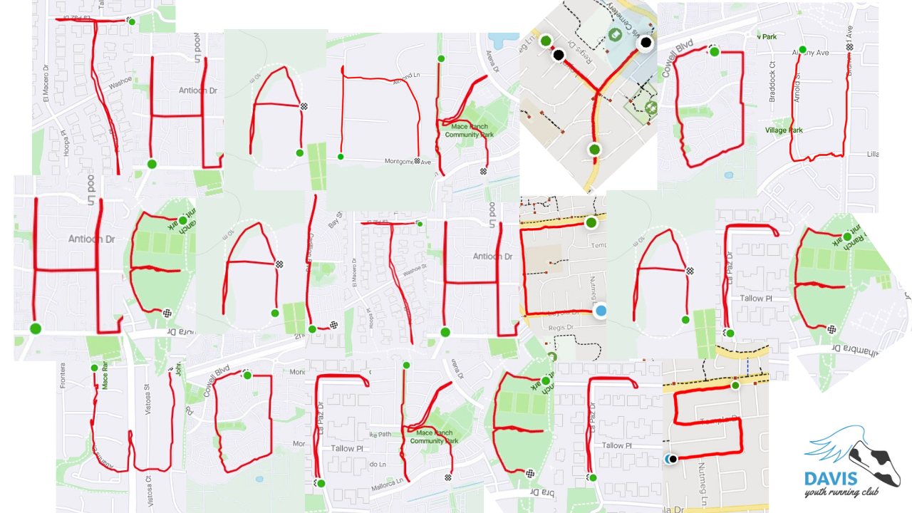
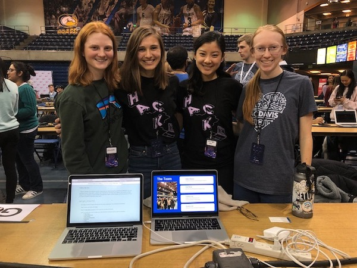
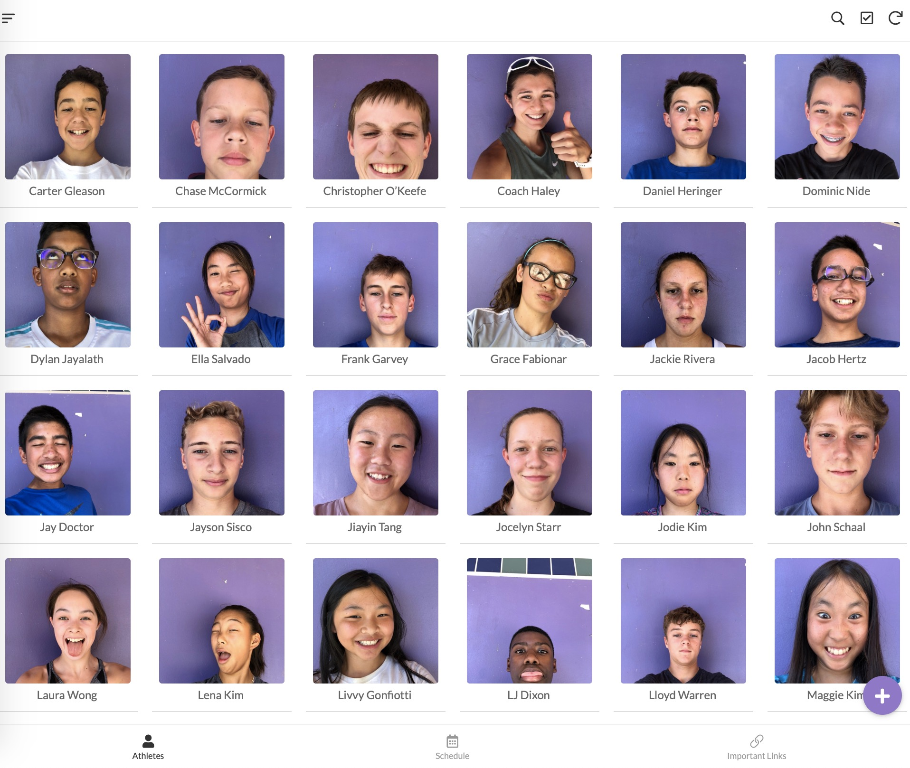

# Davis Youth Running Club
Through the months of June through August 2020 I put on a virtual running club in an effort to motivate kids to get outdoors and move during quarentine. 40 athletes joined the team and we used Strava and Zoom to interact with each other. I created weekly workouts and had the runners partcipate in personal race days where the goal of the run was to strive for a personal record. Throughout the season, each runner used GPS technology to run a letter. As seen below, we created a Strava masterpiece! Check out our team Strava page [here](https://www.strava.com/clubs/dyrc). 
 

# Return Ready
Return Ready came to life at HackDavis2020. With the help of three talented women, we set out to give back to a generation other than our own. Return Ready is designed to alleviate the pain points faced by those who have taken an extended leave of absence from the workforce. On our website, "returners" can find personality quizzes, technical vocabulary definitions, and how-to guides for LinkedIn, resumes, and interviews. Additionally, we highlight organizations that dedicate resources to increasing the inclusivity of “returners” in the workplace.
 

 
If you are interested in learning more about the creation and future plans of Return Ready, you can read my article [here](https://www.haleysmiles.com/blog/2020/01/20/DavisHackathon2020.html).

# Team Progress Tracker
I have worked as a Cross Country and Track coach at Harper Middle School in Davis for the past two years. My ability to maintain a healthy sleep schedule, particpate in extracurriculars, and keep up with my school work became challenging during my first season of coaching. I found that I was often emailing parents, sending out race logistics, and planning workouts in the middle of my math homework. As a means to free myself from some of the logistical burdens of being a coach, I created an app using appsheet to design a central hub for the team.
 

 
Inside the app, parents can find a link to a google form to nodify me of athlete absenses. They can find practice times, race locations, and workout plans for the week. Additionally, each athlete has their own portfolio to track their improvement throughout the season and create personal goals. You can test and view the real version of the application [here](https://www.appsheet.com/start/2d50c2b0-a166-4895-97fa-8776eb35f248#appName=TeamProgressTracker-1051736&page=gallery&sort=%5B%7B%22Column%22%3A%22Name%22%2C%22Order%22%3A%22Ascending%22%7D%5D&table=Athlete&view=Athletes).
